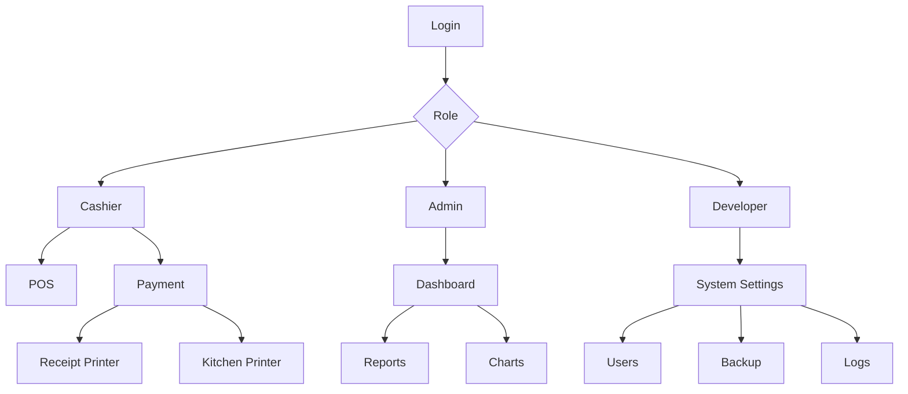

Q: buatkan website kasir pos dengan fitur seperti aplikasi pos pada umumnya. buat dengan stack yang memungkinkan dan gunakan context7 mcp. oh iya klien ingin minta jadikan aplikasi online untuk desktop(.exe) dan android (.apk). pastikan klien hanya tinggal menginstall saja (tidak perlu konfigurasi lagi saat mau menginstall, cukup klik file .exe atau .apk) dan buat aplikasi seringan mungkin karena klien menggunakan device low end. gunakan grafik chart untuk keuangan pada halaman dashboard admin. dan user dibagi menjadi 3. 
1. kasir 
2. admin (pemantau keuangan dan transaksi)
3. sebagai pembuat website (aku)

dan gunakan pembayaran cash. dan gunakan 2 printer pada user kasir. maksudnya 2 printer adalah mencetak struk saat transaksi pembayaran, yang kedua mencetak struk pesanan untuk dapur.
bisakah kamu buat rekomendasi stack apa saja yang digunakan, implementation plan, prd, asii wireframes, mermaid diagram, dan navigation architecture, serta repo arsitektur nya? aku mau deploy di vps ku

A: Bisa. Bahkan dengan requirement yang kamu kasih, aku justru **tidak menyarankan Electron + Next.js** seperti POS modern pada umumnya karena klien menggunakan **device low-end** dan ingin **sekali install langsung jalan**.

Aku akan rekomendasikan arsitektur yang memang dipakai banyak software kasir modern (Toast, Loyverse, Moka dahulu, dll) tetapi disesuaikan agar ringan.

---

# Arsitektur yang saya rekomendasikan

```
                 VPS
        +--------------------+
        |                    |
        |  PostgreSQL        |
        |  Backend API       |
        |                    |
        +---------+----------+
                  ^
                  |
           HTTPS REST API
                  |
      +-----------+-----------+
      |                       |
 Desktop EXE             Android APK
(Tauri + React)        (Capacitor)
      |                       |
      +-----------+-----------+
                  |
          Shared Frontend
          React + Vite
```

Jadi hanya ada **1 frontend**.

Yang dibedakan hanya wrapper.

```
React
   │
   ├── Web
   ├── Desktop (Tauri)
   └── Android (Capacitor)
```

Tidak perlu membuat 3 frontend.

---

# Kenapa bukan Electron?

Electron:

```
Chrome
+
NodeJS
```

RAM:

300-500MB

Sedangkan

Tauri:

```
Native WebView
+
Rust
```

RAM:

30-80MB

Untuk kasir device kentang,

**Tauri menang telak.**

---

# Stack

## Frontend

* React
* Vite
* Typescript
* React Router
* TanStack Query
* Zustand
* TailwindCSS
* shadcn/ui
* Recharts

Kenapa Recharts?

Karena dashboard admin butuh grafik.

---

## Desktop

Tauri v2

Output

```
POS.exe
```

Install:

```
Next
Next
Finish
```

langsung bisa.

---

## Android

Capacitor

Output

```
POS.apk
```

Install

```
Klik APK
Install
```

langsung jalan.

---

## Backend

NodeJS

Fastify

Kenapa bukan Express?

Fastify lebih cepat.

---

ORM

Drizzle ORM

Database

PostgreSQL

---

Authentication

Better Auth

Role

```
Developer
Admin
Cashier
```

---

Storage

Local VPS

Untuk logo toko

Foto produk

Tidak perlu S3.

---

Realtime

Socket.IO

Untuk

Status pesanan

Sinkron kasir

Dashboard admin

---

# Printer

Kasir punya dua printer.

```
Transaksi

↓

Backend

↓

Desktop

↓

Printer A
```

Printer A

```
Cetak Struk
```

Printer B

```
Cetak Pesanan Dapur
```

Flow

```
Bayar

↓

Printer Receipt

↓

Printer Kitchen
```

Bisa menggunakan

ESC/POS

Library

```
node-escpos
```

atau

```
escpos-usb
```

Kalau desktop menggunakan Tauri bisa juga memakai plugin native agar komunikasi ke printer lebih stabil.

---

# Barcode Scanner

Tidak perlu coding khusus.

Karena scanner barcode USB dianggap sebagai keyboard.

Focus pada textbox.

Scanner:

```
899100210001

Enter
```

langsung masuk.

---

# Dashboard

Admin

```
Pendapatan Hari Ini

Pendapatan Minggu

Pendapatan Bulan

Total Order

Produk Terlaris

Jam Ramai

Grafik Pendapatan

Grafik Order

Kategori Terlaris
```

Chart

```
Recharts
```

---

# Hak akses

Developer

```
Semua akses

Backup Database

Restore

Kelola User

Pengaturan

Printer

Log

Monitoring

Lisensi
```

---

Admin

```
Dashboard

Laporan

Keuangan

Produk

Kategori

Promo

Transaksi

Kasir

Pelanggan
```

---

Kasir

```
POS

Cari Barang

Bayar

Riwayat Hari Ini

Open Cash Drawer

Shift
```

---

# Database

```
users

roles

products

categories

transactions

transaction_items

payments

customers

printers

settings

expense

cash_shift

logs
```

---

# Repository

Monorepo

```
pos-system

apps
    desktop
    mobile
    web
    api

packages
    ui
    types
    auth
    utils
    config

docs

docker
```

Karena

Desktop

Mobile

Web

semuanya memakai package UI yang sama.

---

# VPS

Docker

```
Traefik

↓

Fastify

↓

Postgres

↓

Redis
```

Compose

```
services

api

postgres

redis

backup
```

---

# Deployment

```
GitHub

↓

GitHub Actions

↓

VPS

↓

Docker Compose

↓

Done
```

---

# Navigation

Kasir

```
Login

↓

Dashboard

↓

POS

↓

Payment

↓

Receipt
```

---

Admin

```
Dashboard

├── Penjualan
├── Produk
├── Kategori
├── Laporan
├── Pengeluaran
├── User
├── Printer
└── Setting
```

---

Developer

```
Dashboard

├── Monitoring

├── Database

├── Backup

├── Restore

├── User

├── License

├── Log

└── Settings
```

---

# Mermaid



---

# Wireframe

## Kasir

```
---------------------------------------------------

 Search

--------------------------------------------

Burger

Qty +

Pizza

Qty +

--------------------------------------------

Cart

Burger

Pizza

Total

Rp120.000

[CASH]

[BAYAR]

---------------------------------------------------
```

---

## Admin

```
---------------------------------------

Revenue Today

Revenue Month

Orders

Profit

---------------------------------------

Chart Revenue

██████

██

███████

████

---------------------------------------

Best Products

1 Burger

2 Pizza

3 Coffee

---------------------------------------
```

---

## Developer

```
-------------------------------

CPU

RAM

Database

Users

Version

Printer

Logs

Backup

Restore

-------------------------------
```

---

# PRD (ringkas)

## Tujuan

Membangun aplikasi Point of Sale yang:

* Ringan untuk perangkat low-end.
* Bisa berjalan sebagai website, aplikasi desktop (.exe), dan Android (.apk) dari satu basis kode frontend.
* Mendukung pencetakan otomatis ke dua printer (struk pelanggan dan tiket dapur).
* Memiliki dashboard admin dengan grafik keuangan.
* Memiliki tiga peran pengguna: Kasir, Admin, dan Developer.
* Mudah dipasang oleh klien (installer .exe dan .apk tanpa konfigurasi tambahan).

### Fitur inti

* Login berbasis role.
* Manajemen produk & kategori.
* Transaksi tunai (cash).
* Cetak struk pelanggan.
* Cetak tiket dapur.
* Dashboard keuangan dengan grafik.
* Laporan penjualan.
* Manajemen pengguna.
* Pengaturan printer.
* Backup & restore database.
* Audit log.

---

Dengan spesifikasi di atas, aplikasi akan jauh lebih ringan dibanding solusi berbasis Electron, mudah di-maintain, dan cukup fleksibel untuk dikembangkan ke fitur seperti QRIS, stok multi-cabang, atau mode offline di masa depan tanpa perlu mengubah arsitektur dasarnya.
